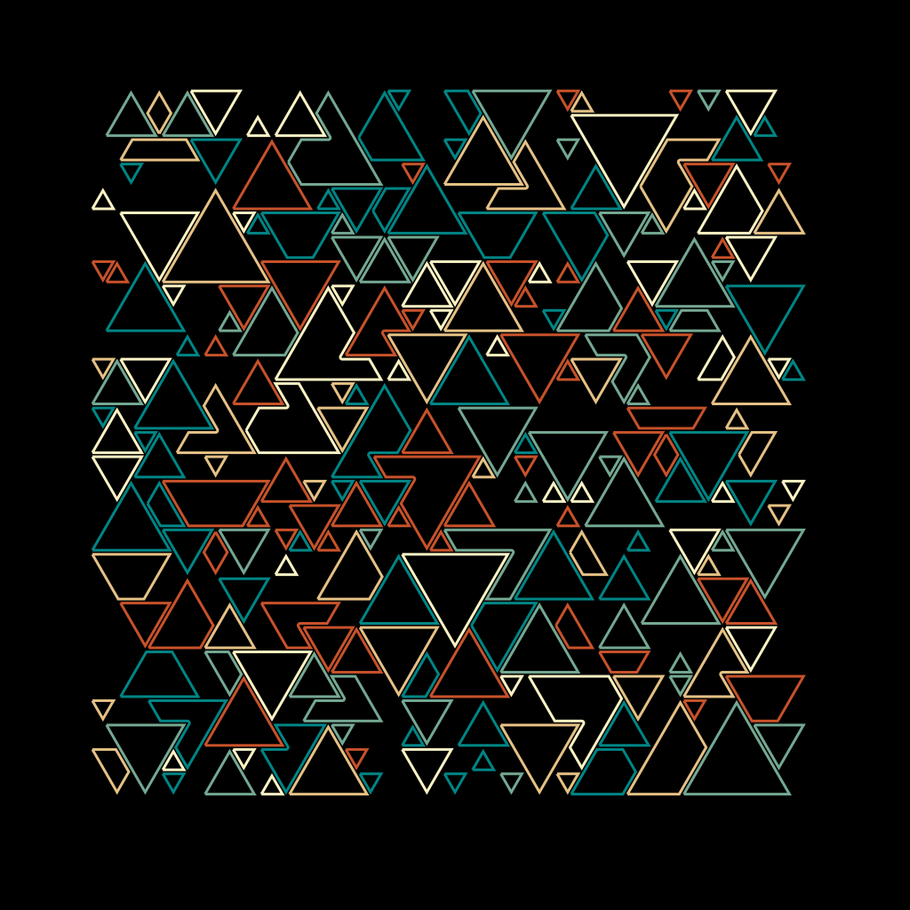

# Penpal

A Python creative coding environment for generating SVGs for pen plotters. Built for reproducible, version-controlled, parameterized generative art.

<div align="center">





</div>

## Quick Start

**Prerequisites:** Python 3.10+, [uv](https://github.com/astral-sh/uv), Git

```bash
# Install dependencies
uv sync

# Run your first sketch (dev mode skips Git checks)
python tools/runner.py 001_hello_world --dev

# Browse results in the gallery
cd app && ./launch.sh
```

## Project Structure

```
penpal/
├── core/          # Shared library (drawing, math, vpype)
├── app/           # Streamlit gallery — browse SVGs, params, Git hashes
├── tools/         # runner.py, plotter utilities (send_hpgl.py, plotter_prep.sh)
├── projects/      # Each sketch is its own Git repo
├── experiments/   # Parameter files (default.py, default.json, example.json)
└── gallery/       # Generated outputs
    └── <project>/
        ├── svg/<git-hash>/     # Production runs
        └── test/<timestamp>/   # Dev runs
```

## Running Sketches

The `tools/runner.py` script handles execution with full reproducibility:

```bash
# Standard run — requires clean Git state, saves to gallery/<project>/svg/<git-hash>/
python tools/runner.py 001_hello_world

# Dev run — skips Git checks, saves to gallery/<project>/test/<timestamp>/
python tools/runner.py 001_hello_world --dev

# Custom parameters (overrides all files)
python tools/runner.py 001_hello_world --dev --params '{"seed": 42, "num_lines": 200}'

# Use a named parameter file from experiments/<project>/
python tools/runner.py 001_hello_world --dev --param-file my_variant

# Auto-commit before running (convenience for WIP)
python tools/runner.py 001_hello_world --auto-commit
```

### Parameter Resolution (highest priority first)

1. `--params '{"key": "value"}'` — inline JSON
2. `--param-file name` — loads `experiments/<project>/name.py` or `name.json`
3. `experiments/<project>/default.py` or `default.json`
4. `<project>/example.json` — fallback bundled with the sketch

Each run saves a JSON sidecar with timestamp, Git hash, parameter hash, and the full parameter set.

## Creating a New Sketch

```bash
mkdir projects/005_my_sketch && cd $_
git init
uv init
uv add penpal-core  # or: uv add ../core
```

Required files:
- `main.py` — defines `run(params: dict, output_path: str)`
- `example.json` — sample parameter set

Add parameter variants in `experiments/005_my_sketch/` as `default.py`, `default.json`, or custom names.

## Gallery (Streamlit App)

```bash
cd app
./launch.sh
# or: uv run python -m streamlit run main.py
```

Two modes:
- **Regular** — production runs with Git history
- **Test** — dev runs; edit parameters inline and re-run from the UI

Config priority: CLI args → env vars (`PENPAL_GALLERY_DIR`, `PENPAL_PROJECT_DIR`, `PENPAL_RUNNER_SCRIPT_PATH`) → defaults.

## Plotter Pipeline

1. **vpype** — optimizes SVGs for plotting (sort, simplify, linesort). See `tools/plotter_prep.sh`.
2. **send_hpgl.py** — streams HPGL to serial (tested with HP 7475A).

```bash
# Example: optimize then send
vpype read output.svg linesort write optimized.svg
python tools/send_hpgl.py optimized.svg /dev/ttyUSB0
```

## Troubleshooting

| Issue | Fix |
|-------|-----|
| "Git repo not clean" | Commit changes, or use `--auto-commit` / `--dev` |
| "Not a Git repository" | Run `git init` inside the project folder |
| Module import errors | Run `uv sync` in the project directory |
| "main.py must define run()" | Ensure `def run(params, output_path):` exists |

## License

MIT